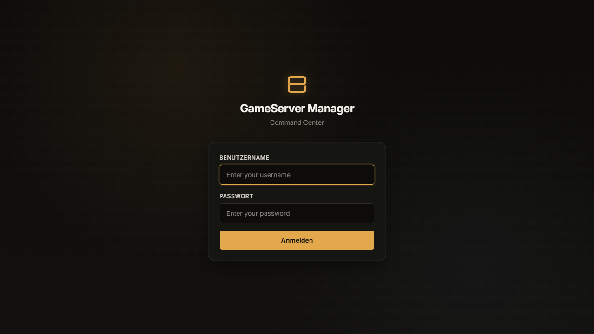
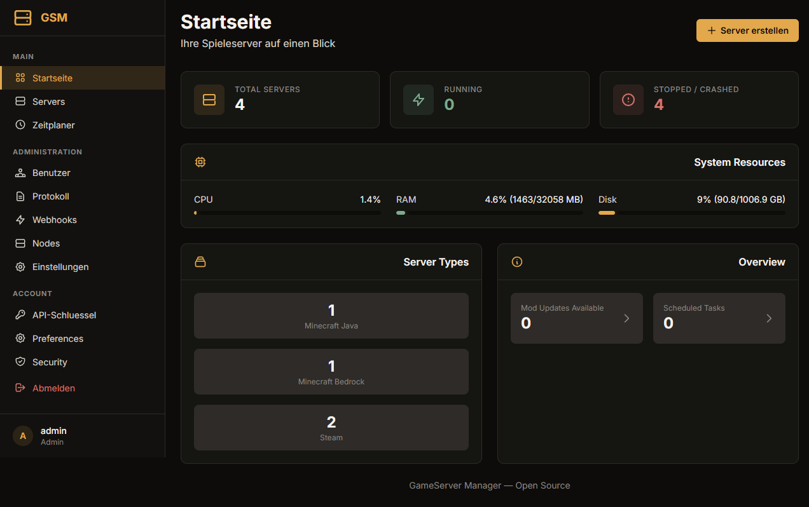
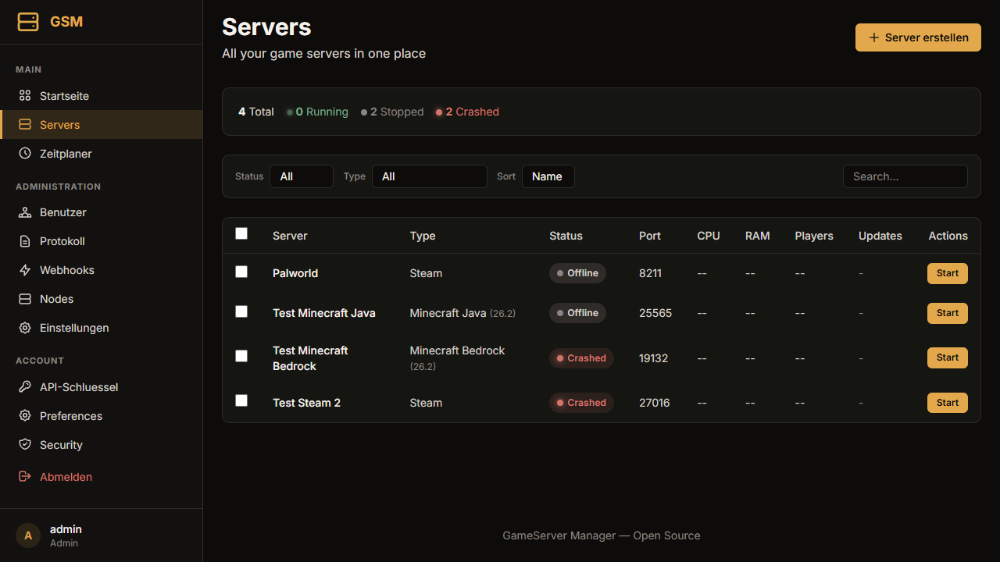
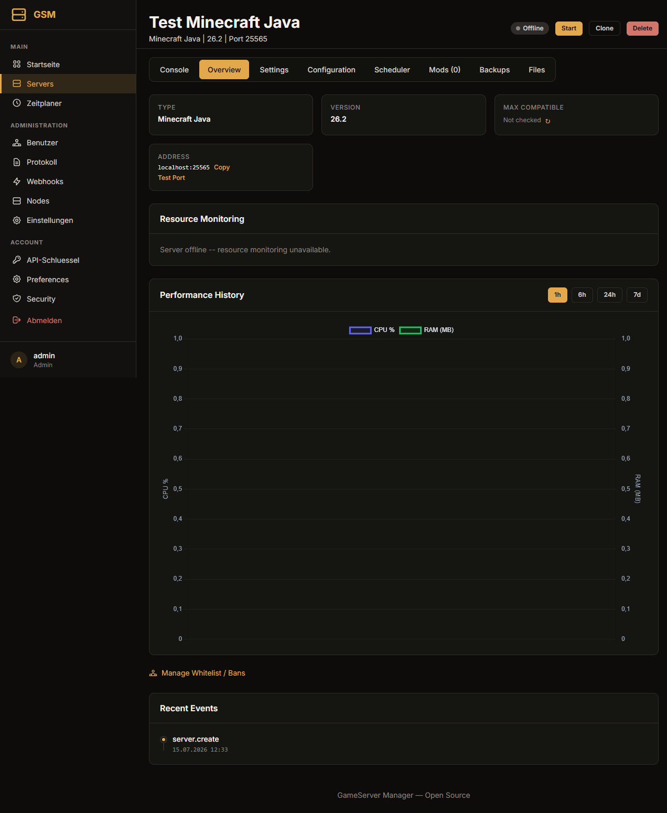

<p align="center">
  
</p>

<h1 align="center"><font color="#c4923f">GameServer Manager</font></h1>


A web-based game server management panel for Minecraft (Java/Bedrock) and Steam game servers. Built with Python 3.12 and FastAPI, featuring real-time WebSocket consoles, automatic mod management, and a modern dark-theme UI.

## Features

### Server Management
- Create, start, stop, restart, and delete Minecraft Java/Bedrock and Steam game servers
- Automatic Java version detection (JDK 8, 17, 21, 25) per Minecraft version
- Server JAR auto-download (Vanilla, Fabric, Paper, Forge, NeoForge, Quilt)
- SteamCMD integration for Steam game servers (CS2, Valheim, Rust, ARK, and more)
- Server import -- detect and add existing server installations
- Server cloning
- Auto-start servers on panel boot
- Server templates and quick-setup presets
- Automatic server update checking and application
- Per-server environment variables
- Docker container isolation per server (optional)

### Real-Time Console
- WebSocket-based live console with command input
- Console command history
- RCON client support

### Mod Management
- Modrinth mod search, install, and auto-update
- CurseForge mod integration
- SpigotMC/Hangar plugin sources
- Mod conflict detection and dependency resolution
- Loader version tracking (Fabric, Paper, Forge, NeoForge, Quilt)

### Player Management
- Online player list (Minecraft SLP + Steam A2S query protocols)
- Minecraft whitelist and ban management

### File Management
- Web-based file browser and text editor
- Drag-and-drop file upload
- File download, deletion, rename, and directory creation
- Archive operations (zip/unzip)
- File search across server directories
- SFTP access (optional)

### Backups
- Manual and scheduled backups with configurable rotation
- Backup restore

### Monitoring
- Real-time resource monitoring (CPU, RAM, disk)
- Performance graphs with historical data
- Prometheus/OpenMetrics endpoint (optional)
- Audit log with 90-day retention

### User System
- User authentication with login/sessions
- TOTP two-factor authentication
- WebAuthn passkey authentication (optional)
- Role-based access control (RBAC) with per-server permissions
- Multi-user management

### Notifications
- Discord webhook notifications (start, stop, crash, backup events)
- Custom webhooks with HMAC signing
- Email notifications via SMTP (optional)

### Infrastructure
- Multi-node panel support (optional)
- REST API v1 with JSON endpoints and API key authentication
- OpenAPI/Swagger documentation at `/api/docs`
- Scheduled task system (cron-like)
- Public status page (optional)
- Panel self-update checker
- Progressive Web App (PWA) support
- Multi-language support (English, German)
- Light/dark theme toggle
- HTTPS/SSL with auto-generated self-signed certificates
- CSRF protection
- Reverse proxy support (Nginx, Caddy, Traefik)

## Tech Stack

| Technology | Purpose |
|---|---|
| Python 3.12 | Runtime |
| FastAPI | Async web framework |
| SQLAlchemy 2.0 (async) | ORM with asyncio support |
| PostgreSQL 17 | Primary database (via asyncpg) |
| SQLite | Alternative database (via aiosqlite) |
| Alembic | Database migrations |
| Jinja2 | Server-side HTML templates |
| Tailwind CSS | Utility-first CSS (dark theme) |
| Pydantic v2 | Data validation and settings |
| APScheduler | Periodic task scheduling |
| WebSocket | Real-time server console |
| httpx | Async HTTP client (Modrinth, CurseForge, JAR downloads) |
| Docker | Containerization |

## Screenshots

| Login | Dashboard |
|---|---|
|  |  |

| Servers List | Server Detail |
|---|---|
|  |  |

## Quick Start

### Docker (Recommended)

```bash
# Clone the repository
git clone <repo-url> gameserver
cd gameserver

# Copy and configure environment
cp .env.example .env
# Edit .env -- at minimum change GSM_SECRET_KEY

# Start the application
docker compose up -d
```

The panel will be available at **https://localhost:8443** by default. Set `GSM_HOST_PORT` in `.env` to use a different host port (for example, `GSM_HOST_PORT=9000`).

The Docker image includes Java 8, 17, 21, and 25 for Minecraft server compatibility.

### Local Development

```bash
# Prerequisites: Python 3.12, PostgreSQL 17 (or use SQLite)

python -m venv .venv
.venv\Scripts\activate           # Windows
# source .venv/bin/activate      # Linux/Mac

pip install -r requirements.txt

cp .env.example .env
# Edit .env -- set GSM_DATABASE_URL and GSM_SECRET_KEY

# Run database migrations
alembic upgrade head

# Start the application
python main.py
```

## Configuration

All settings use the `GSM_` prefix and can be set via environment variables or `.env` file. Most settings can also be configured through the web UI at `/settings/` (admin only).

See [.env.example](.env.example) for all available configuration options.

### Key Settings

| Variable | Default | Description |
|---|---|---|
| `GSM_SECRET_KEY` | `change-me-in-production` | Session secret key |
| `GSM_DATABASE_URL` | `postgresql+asyncpg://gsm:gsm@db:5432/gameserver` | Database connection URL |
| `GSM_PORT` | `8443` | Web UI port |
| `GSM_DEBUG` | `false` | Debug mode |
| `GSM_SSL_ENABLED` | `false` | Enable HTTPS (auto-enabled in Docker) |
| `GSM_MOD_CHECK_INTERVAL_MINUTES` | `60` | Mod update check interval |
| `GSM_DOCKER_ISOLATION_ENABLED` | `false` | Docker container isolation per server |
| `GSM_SFTP_ENABLED` | `false` | SFTP file access |
| `GSM_MULTI_NODE_ENABLED` | `false` | Multi-node panel mode |

### Database Backends

PostgreSQL 17 is the default and recommended database. SQLite and MySQL are also supported. See [docs/database-backends.md](docs/database-backends.md) for details.

## HTTPS/SSL

The Docker image generates a self-signed certificate automatically. For production, use a reverse proxy with proper certificates.

### Reverse Proxy

See [docs/reverse-proxy/](docs/reverse-proxy/) for Nginx, Caddy, and Traefik configuration examples.

### Direct SSL

```env
GSM_SSL_ENABLED=true
GSM_SSL_CERTFILE=/path/to/cert.pem
GSM_SSL_KEYFILE=/path/to/key.pem
```

## API

REST API v1 is available at `/api/v1/` with API key authentication. Interactive documentation is at `/api/docs` (Swagger) and `/api/redoc` (ReDoc).

## License

See [LICENSE](LICENSE) for details.
